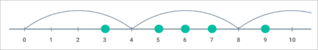

# Ejercicio Salto Mínimo (JAVA)

## Pregunta Técnica:

Se le proporciona una serie de números enteros que representan las coordenadas de los obstáculos situados en línea recta.

Suponga que está saltando desde el punto con la coordenada 0 hacia la derecha. Solo se le permite realizar saltos de la misma longitud representados por algún número entero.

Encuentre la longitud mínima del salto suficiente para evitar todos los obstáculos.

##### Ejemplo:

Para:

- arreglo = [5, 3, 6, 7, 9]

La salida debe ser:

- saltoMinimo(arreglo) = 4

#### Entradas sugeridas y Salidas esperadas:

En la plantilla (repositorio), se utiliza como parámetro de entrada el siguiente formato:

- "lista de numeros (obstaculos) separados por coma"
- Ejemplo: "5,3,6,7,9"
- El parámetro está siendo alojado en la variable 'arrayObstacles'

Y se espera como resultado la longitud mínima del salto y que sea asignada a la variable 'minimumJump' y se presentará lo sigueinte:

- The minimum jump to avoid all obstacles is: [minimumJump]
- Ejemplo: The minimum jump to avoid all obstacles is: 4
